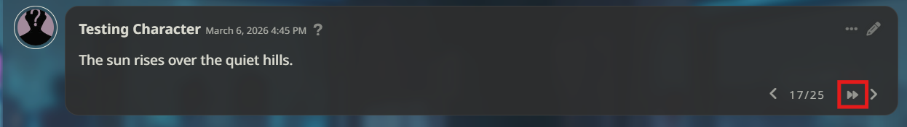
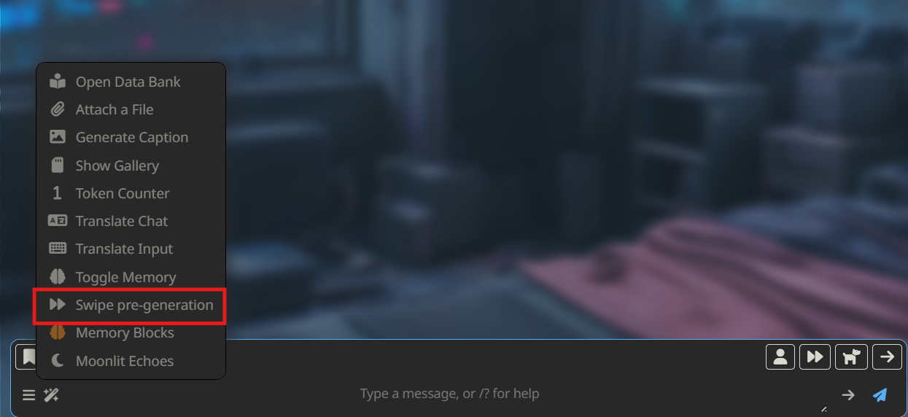

# SwipePregen

Generates the next AI reply in the background while you keep reading the current one. When it is done (and you finished reading the old one) just swipe like usually to the side and you can see the next reply. You also can batch multiple swipes at once.

## Features

**Background button** — a small double arrow icon appears next to the swipe-right chevron on the last AI message. Click it once to silently generate a new swipe. The current message stays fully readable while streaming happens underneath, and a toast notifies you when the new reply is ready.

**Batch pre-generation** — open the Extensions wand menu → *Swipe pre-generation* to queue up to 20 swipes at once. A progress bar at the top of the chat tracks the run and has an abort button.

Both modes use SillyTavern's normal generation pipeline, so your API settings, samplers, and prompt templates apply as usual.

## Installation

### Method 1

1. Open the Extensions menu on Sillytavern.
2. Click the "Install Extension" button.
3. Input `https://github.com/Nicoolodion/SillyTavern-SwipePregen` and click "Install".

### Method 2

1. Open a terminal and navigate to one of the following extension folders:
   * `SillyTavern/public/scripts/extensions/`
   * `SillyTavern/public/scripts/extensions/third-party/`
2. Run the command `git clone https://github.com/Nicoolodion/SillyTavern-SwipePregen`
3. Restart SillyTavern or reload the page.
4. Enable the extension in the Extensions panel.

## Usage

| Action | How |
|---|---|
| Generate one swipe | Click >> next to the → chevron on the last message |
| Generate multiple swipes | Wand menu → *Swipe pre-generation* |
| Stop a running batch | Click the stop button in the progress bar |

The button is only shown on the last message when it belongs to the AI. While any generation is in progress the icon spins; clicking it again will show a warning instead of starting a second generation.

## Settings

Saved per-user in SillyTavern's extension settings:

| Setting | Default | Description |
|---|---|---|
| Default batch size | `3` | Value pre-filled in the batch modal |
| Show progress bar | on | Toggle the progress bar during batch runs |

## Translations

Translation files live in `i18n/`. English (`en.json`) is the reference. To add a language, copy it, rename it to your locale code (e.g. `ru.json`), translate the values, and open a PR. Yes these are ai generated, but open an pull request if there are errors.

Included: `en`, `de`, `zh-CN`, `fr`.

## License

MIT - Do what you want with it.
